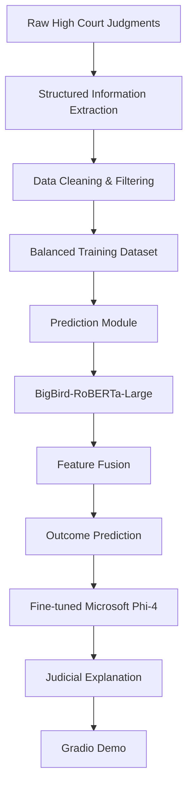

<div align="center">

# ⚖️ IBPS-v0.2
### Indian Bail Prediction System

**AI-assisted Bail Outcome Prediction and Judicial Rationale Generation for Indian High Court Cases**

[]()
[](LICENSE)
[]()
[]()

</div>

---

## Overview

The **Indian Bail Prediction System (IBPS)** is a research framework for **predicting bail outcomes** and **generating judicial-style legal explanations** from Indian High Court bail judgments.

Unlike traditional court judgment prediction systems that only classify case outcomes, IBPS jointly models:

- **Bail Outcome Prediction**
- **Judicial Rationale Generation**

The system combines structured legal attributes, statutory information, long-context document understanding, and Large Language Models (LLMs) to produce interpretable, legally grounded predictions.

IBPS has been developed as a **research and decision-support framework** for Legal NLP and computational law. It is **not intended to replace judicial decision making**.

---

# Highlights

- 📚 Large-scale dataset containing **89,969 Indian High Court bail judgments**
- ⚖️ Supports both **Regular Bail** and **Anticipatory Bail**
- 🤖 Two-stage architecture
  - BigBird-based bail prediction
  - Fine-tuned Microsoft Phi-4 explanation generation
- 📖 Structured legal information extraction from raw court judgments
- 🔍 SHAP-based statutory feature engineering
- 👨‍⚖️ Human expert evaluation
- 🤖 LLM-as-a-Judge (G-Eval) evaluation
- 🌐 Gradio interface for interactive inference
- 🔬 Complete reproducible research pipeline

---

# Motivation

Bail adjudication forms a significant portion of criminal litigation in India. Courts must consider numerous legal and factual factors including:

- Nature of offence
- Criminal history
- Custody duration
- Health conditions
- Applicable statutes
- Case facts
- Judicial precedents

These decisions require extensive legal reasoning and consistency.

IBPS investigates whether modern AI systems can assist legal research by learning meaningful representations from historical bail judgments while also producing transparent explanations for their predictions.

Rather than treating bail prediction as a simple classification task, IBPS models the complete judicial reasoning pipeline by combining prediction with explanation generation.

---

# System Architecture



---

# Methodology

IBPS follows a **two-stage architecture**.

## Stage 1 — Bail Outcome Prediction

The prediction module combines three complementary information sources:

- Long-context textual representation using **BigBird-RoBERTa-Large**
- Structured numerical case attributes
- SHAP-derived statutory representations obtained from an auxiliary XGBoost model

These representations are fused into a unified feature vector for binary bail prediction.

---

## Stage 2 — Judicial Rationale Generation

The predicted bail outcome is supplied to a fine-tuned **Microsoft Phi-4** model together with:

- Case details
- Statutory provisions
- Criminal history
- Custody information
- Health information
- Structured legal attributes

The language model then generates a judicial-style explanation consistent with the predicted outcome.

---

# Repository Structure

```
IBPS-v0.2
│
├── Data/
│   └── Data.txt
│
├── Eval/
│   ├── Expert eval/
│   └── G-Eval/
│
├── Training_classifier/
│
├── Training_explanation_module/
│
├── model/
│
├── app.py
├── inference.py
├── comments.txt
├── LICENSE
└── README.md
```

---

# Directory Description

| Directory | Description |
|------------|-------------|
| **Data/** | Dataset information and download links. |
| **Eval/** | Evaluation scripts, notebooks, expert annotations, and G-Eval experiments. |
| **Training_classifier/** | Training pipeline for the bail outcome prediction model. Includes preprocessing, augmentation, SHAP feature engineering, baselines, and classifier training. |
| **Training_explanation_module/** | Data preparation and Axolotl configuration for fine-tuning the explanation generation model. |
| **model/** | Links to pretrained model checkpoints hosted on Hugging Face. |
| **app.py** | Gradio application for interactive inference. |
| **inference.py** | Standalone inference pipeline. |
| **comments.txt** | Additional notes regarding dataset preparation and Axolotl training commands. |

---

# Repository Contents

## 📂 Data

The repository does **not** directly include the complete dataset because of its size.

Instead, the dataset can be downloaded using the Google Drive link provided in

```
Data/Data.txt
```

The released dataset contains structured information extracted from Indian High Court bail judgments.

---

## 🤖 Pretrained Models

Pretrained checkpoints are hosted separately on Hugging Face.

The download link is available in

```
model/path.md
```

The repository therefore remains lightweight while still allowing complete reproduction of the experiments.

---

# Project Components

The repository is organized into four major components.

## 1. Data Preparation

- Structured information extraction
- Dataset cleaning
- Dataset balancing
- Data augmentation
- Statutory preprocessing

---

## 2. Bail Outcome Prediction

Implements the complete classification pipeline including

- Logistic Regression baseline
- MLP baseline
- BigBird encoder
- SHAP feature engineering
- Training scripts
- Evaluation notebooks

---

## 3. Judicial Explanation Generation

Contains

- Prompt preparation
- Fine-tuning dataset creation
- Axolotl configuration
- Reasoning inference preprocessing

---

## 4. Evaluation

IBPS evaluates generated explanations using both

- Human legal experts
- GPT-based G-Eval

making it possible to compare automatic evaluation against expert judgement.

# Dataset

The complete dataset is hosted separately because of its size.

The download link is available in

```
Data/Data.txt
```

After downloading, place the dataset in the appropriate directory before running any training or evaluation scripts.

---

## Dataset Pipeline

```
Raw High Court Judgments
          │
          ▼
Information Extraction
          │
          ▼
Cleaning
          │
          ▼
Balancing
          │
          ▼
Data Augmentation
          │
          ▼
Final Training Dataset
```

The final cleaned and balanced dataset is

```
data_augmented.json
```

from which the

- train.json
- val.json
- test.json

splits are derived.

---

# Pretrained Models

Pretrained model checkpoints are hosted separately on Hugging Face.

The download link is available in

```
model/path.md
```

Download the required checkpoints and update the model paths before running inference.

---

# Training

IBPS contains two independent training pipelines.

```
Training_classifier/
```

and

```
Training_explanation_module/
```

---

# Training the Bail Prediction Model

Navigate to

```
Training_classifier/
```

The directory contains

| File | Purpose |
|------|----------|
| baseline.ipynb | Baseline experiments |
| clf_training.ipynb | Interactive classifier training |
| clf_training.py | Main training script |
| data_augmentation.ipynb | Dataset augmentation |
| statute_processing.ipynb | SHAP-based statute preprocessing |
| overfit_testing.py | Sanity checking |

The complete pipeline includes

1. Dataset preprocessing
2. Data balancing
3. Data augmentation
4. Statutory feature engineering
5. Classifier training
6. Performance evaluation

---

# Fine-tuning the Explanation Module

The explanation generator is fine-tuned using **Axolotl**.

The directory

```
Training_explanation_module/
```

contains

| File | Purpose |
|------|----------|
| axolotl_config.yaml | Fine-tuning configuration |
| data_prep_ft.ipynb | Training data preparation |
| reasoning_inference_prep.ipynb | Inference preprocessing |

To launch fine-tuning:

```bash
CUDA_VISIBLE_DEVICES=0,1,2,3,4,5,6 \
AXOLOTL_DO_NOT_TRACK=1 \
accelerate launch \
--main_process_port 29501 \
--num_processes 7 \
-m axolotl.cli.train \
ft_w_statutes_7_layers.yaml
```

This command starts distributed LoRA fine-tuning using multiple GPUs.

---

# Inference

For command-line inference,

```bash
python inference.py
```

or launch the interactive interface

```bash
python app.py
```

Both pipelines use the pretrained models downloaded from the Hugging Face repository.

---

# Evaluation

IBPS evaluates explanation quality using two complementary evaluation strategies.

```
Eval/
```

contains the complete evaluation pipeline.

---

## 1. Human Expert Evaluation

```
Eval/Expert eval/
```

Includes

- Human annotations
- Inter-Annotator Agreement notebooks
- Evaluation samples
- Consolidated evaluation files
- Exported CSV and Excel results

Key files include

```
IAA.ipynb
IAA2.ipynb
merged_human_evaluation.json
expert_eval_samples.json
```

---

## 2. G-Eval

```
Eval/G-Eval/
```

Contains the complete automatic evaluation framework.

Included resources

- Evaluation prompts
- System prompts
- GPT evaluation script
- Analysis notebook
- Result files

Main files

```
gpt-eval.py
analysis.ipynb
results.json
```

The evaluation framework supports comparisons between

- Base model
- Fine-tuned model
- Alternative model configurations

making it easy to reproduce the reported experiments.

---

# Research Workflow

The complete IBPS workflow can be summarized as

```
Dataset Collection
        │
        ▼
Information Extraction
        │
        ▼
Dataset Cleaning
        │
        ▼
Classifier Training
        │
        ▼
Outcome Prediction
        │
        ▼
Phi-4 Fine-tuning
        │
        ▼
Explanation Generation
        │
        ▼
Human Evaluation
        │
        ▼
G-Eval
```

---
# Results

IBPS provides a complete research pipeline for:

- Structured information extraction from Indian High Court bail judgments
- Bail outcome prediction
- Judicial rationale generation
- Human expert evaluation
- LLM-based automatic evaluation

The repository contains all scripts required to reproduce the experimental pipeline described in the accompanying research work.


# Roadmap

Future releases of IBPS will include:

- [ ] `requirements.txt`
- [ ] Docker support
- [ ] One-click installation
- [ ] Additional pretrained checkpoints
- [ ] More benchmark datasets
- [ ] Multi-GPU inference support
- [ ] Extended legal reasoning benchmarks
- [ ] Better documentation and tutorials

---

# Frequently Asked Questions

<details>

<summary><strong>Where can I download the dataset?</strong></summary>

The dataset download link is provided in

```
Data/Data.txt
```

</details>

<details>

<summary><strong>Where are the pretrained models?</strong></summary>

The pretrained checkpoints are hosted on Hugging Face.

The download link is available in

```
model/path.md
```

</details>

<details>

<summary><strong>Can I reproduce the experiments?</strong></summary>

Yes.

The repository includes:

- Data preparation
- Classifier training
- Explanation model fine-tuning
- Human evaluation
- G-Eval pipeline
- Inference code

allowing the complete research workflow to be reproduced.

</details>

<details>

<summary><strong>Does this repository include the complete dataset?</strong></summary>

No.

The repository only contains the download link because the dataset is too large to host directly on GitHub.

</details>

<details>

<summary><strong>Does this repository include pretrained model weights?</strong></summary>

The pretrained checkpoints are hosted separately on Hugging Face to keep the repository lightweight.

</details>

---

# Acknowledgements

We would like to thank everyone who contributed to this project through discussions, feedback, evaluation, and testing.

We also acknowledge the open-source community whose tools and libraries made this research possible.

This project builds upon several excellent open-source ecosystems, including:

- PyTorch
- Hugging Face Transformers
- PEFT
- Axolotl
- Gradio
- Scikit-learn
- SHAP
- Pandas
- NumPy

---

# License

This project is released under the **MIT License**.

See the [LICENSE](LICENSE) file for details.

---

# Disclaimer

This repository is intended **solely for research purposes**.

The predictions and explanations generated by IBPS **must not** be interpreted as legal advice or judicial decisions.

IBPS is designed as a decision-support and legal AI research framework. Any outputs produced by the system should always be reviewed by qualified legal professionals. The authors assume no responsibility for decisions made using this software.

---

# Contact

For questions, bug reports, or research collaborations, please open an issue in this repository.

Contributions, suggestions, and pull requests are always welcome.

---

<div align="center">

### ⭐ If you find this project useful, please consider giving it a star!

It helps increase the visibility of the project and supports future research in Legal AI.

</div>
